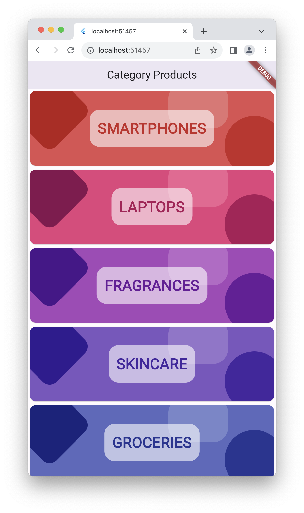
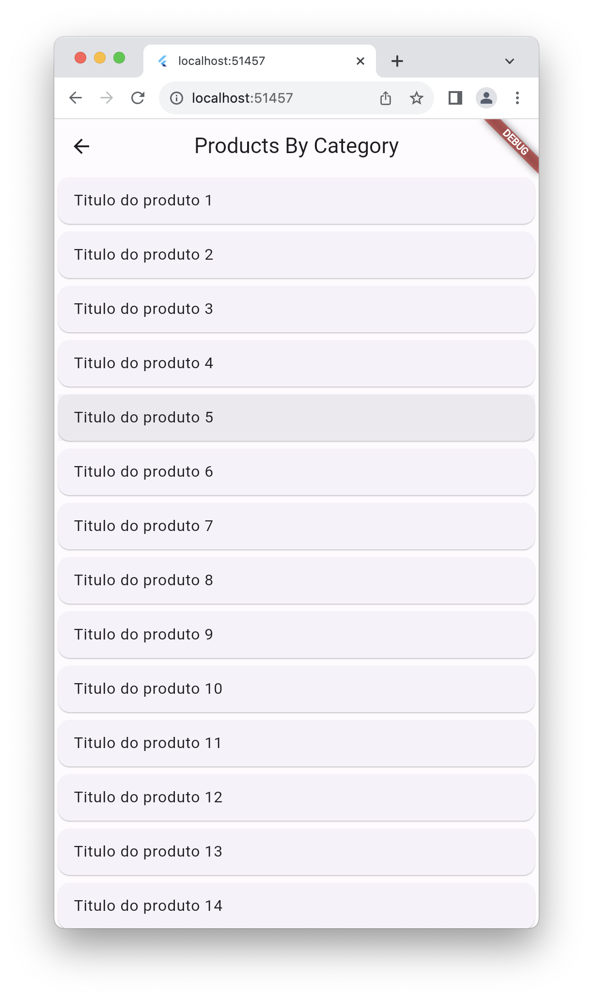
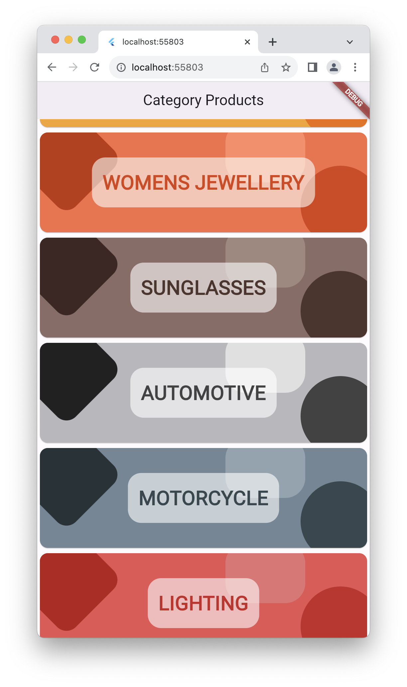
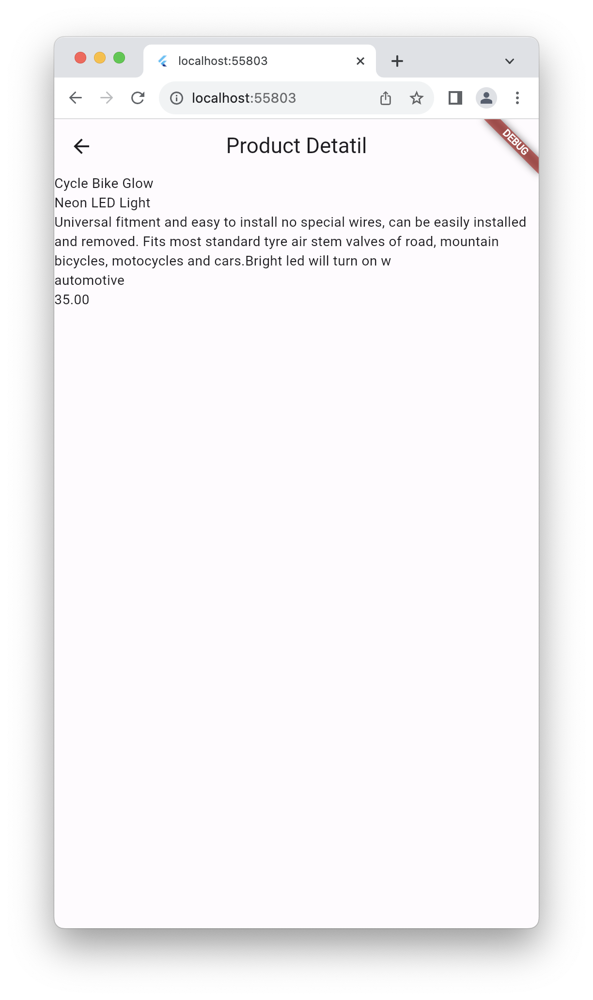

# From Zero to Hero

Este projeto tem por objetivo dar um boost na utilização do Flutter para aplicativos moveis com a possibilidade de utilização de múltiplas plataformas.

Vamos criar um projeto que irá focar no app como front-end utilizando também gerencia de estado para  desacoplamento das camadas do aplicativo.

Iremos consumir o serviço de produtos [DummyJSON](https://dummyjson.com/docs/products).

## Criando o Projeto

> Caso você não clone o projeto deste repositório, utilize o comando criação abaixo  partir do diretorio de sua preferencia execute .

```shell
flutter create --project-name=from_zero_to_hero --org=br.gov.sp.fatecararas --platforms=web,android from_zero_to_hero
```

Caso contrário é clonar este repositório.

## Incluindo as dependencias

Iremos utilizar alguns pacotes de terceiros que irão facilitar o nosso desenvolvimento.

### Dependencias Padrão

Em outro momento discutiremos todas estas dependencias detalhadamente; hoje é dia de **Hands ON**!

```shell
flutter pub add flutter_riverpod riverpod_annotation freezed_annotation json_annotation dio
```

### Dependencias com geração de código automático

```shell
dart pub add --dev build_runner custom_lint riverpod_generator riverpod_lint freezed json_serializable
```

#### Ajustando os warnings de geração de código automática

Inclua no arquivo `analysis_options.yaml` o código abaixo.

```yml
analyzer:
  plugins: 
    - custom_lint
  exclude:
    - "**/*.g.dart"
    - "**/*.freezed.dart"
```

## O que iremos fazer?

Basicamente iremos consumir inicialmente 3 end-points do `DummyJSON`, **/products/categories** e **/products/categoty/{categoty_id}** e **/products/{id}**.

### Estrutura da respostas das requisições

Abaixo teremos as requisições que iremos consumir assim como as respostas das mesmas; com base nestas informações iremos criar as funcionalidades de nosso App.

### Categorias de produtos

#### Request
```shell
curl -X GET https://dummyjson.com/products/categories
``` 

#### Response

```json
[
  "smartphones",
  "laptops",
  "fragrances",
  "skincare",
  "groceries",
  "home-decoration",
  "furniture",
  "tops",
  "womens-dresses",
  "womens-shoes",
  "mens-shirts",
  "mens-shoes",
  "mens-watches",
  "womens-watches",
  "womens-bags",
  "womens-jewellery",
  "sunglasses",
  "automotive",
  "motorcycle",
  "lighting"
]
```

### Produtos por categoria

#### Request
```shell
curl -X GET https://dummyjson.com/products/category/groceries
``` 

#### Response

```json
{
  "products": [
    {
      "id": 21,
      "title": "- Daal Masoor 500 grams",
      "description": "Fine quality Branded Product Keep in a cool and dry place",
      "price": 20,
      "discountPercentage": 4.81,
      "rating": 4.44,
      "stock": 133,
      "brand": "Saaf & Khaas",
      "category": "groceries",
      "thumbnail": "https://cdn.dummyjson.com/product-images/21/thumbnail.png",
      "images": [
        "https://cdn.dummyjson.com/product-images/21/1.png",
        "https://cdn.dummyjson.com/product-images/21/2.jpg",
        "https://cdn.dummyjson.com/product-images/21/3.jpg"
      ]
    },
    ...
  ],
  "total": 5,
  "skip": 0,
  "limit": 5
}
```

### Produtos por ID

#### Request
```shell
curl -X GET https://dummyjson.com/products/1
``` 

#### Response
```json
{
  "id": 1,
  "title": "iPhone 9",
  "description": "An apple mobile which is nothing like apple",
  "price": 549,
  "discountPercentage": 12.96,
  "rating": 4.69,
  "stock": 94,
  "brand": "Apple",
  "category": "smartphones",
  "thumbnail": "https://cdn.dummyjson.com/product-images/1/thumbnail.jpg",
  "images": [
    "https://cdn.dummyjson.com/product-images/1/1.jpg",
    "https://cdn.dummyjson.com/product-images/1/2.jpg",
    "https://cdn.dummyjson.com/product-images/1/3.jpg",
    "https://cdn.dummyjson.com/product-images/1/4.jpg",
    "https://cdn.dummyjson.com/product-images/1/thumbnail.jpg"
  ]
}
```

# LET`s GO

Com base nas aulas passadas, já temos as telas criadas com a devida navegação, a navegação discutiremos o inicio da próxima aula.

Temos o aplicativo criado sem a utilização da Gerencia de estado com RiverPod.

Este repositório como está na branch main teremos o código inicial, na branch final o código completo em breve.

## Criando os repositórios de Categorias e Produtos

### O provedor Dio

Um provedor ou provider é uma simples instancia de objetos ou coleções de objetos observáveis que `proveem ` dados para nossa camada de apresentação.

Assim como utilizado nos demais frameworks o coneito de injeção dependencia (DI), iremos utilizar utilizá-la neste projeto, para tal precisamos `injetar` o provedor para o **Dio**.

O **Dio** é um pacote que gerencia requisicões REST e irmos utilizá-lo para realizar as requisições no `DummyJSON`.

#### Crie o Dio Provider

No arquivo `features\products\presentation\dio_provider.dart` inclua o código abaixo.

```dart
import 'package:dio/dio.dart';
import 'package:riverpod_annotation/riverpod_annotation.dart';

part 'dio_provider.g.dart';

@riverpod
Dio dio(DioRef ref) {
  return Dio(BaseOptions(baseUrl: 'https://dummyjson.com/products'));
}
```
#### Crie o repositório de produtos

Inclua o código abaixo para realizarmos a requisição das categorias de produtos para podermos exibi-las na tela de visualiação de categorias.

1. Crie a classe `features/products/domain/product_repository.dart`

```dart
abstract class ProductRepository {
  Future<List<String>> findAll();
}
```

2. Implemente a interface em `features/products/data/product_repository_impl.dart`.
```dart
import 'package:dio/dio.dart';

part 'product_repository_impl.g.dart';

class ProductRepositoryImpl implements ProductRepository {
  final Dio dio;

  ProductRepositoryImpl({required this.dio});

  Future<List<String>> findAll() async {
    final response = await dio.get('/categories');
    return [for(final category in response.data as List) category.toString()];
  }
}

// Criação do provedor de repository como DI.
@riverpod
ProductRepositoryImpl productRepository(ProductRepositoryRef ref) {
  return ProductRepositoryImpl(dio: ref.watch(dioProvider));
}

```

#### Crie o provedor de categorias

O provedor abaixo irá disponibilizar as categorias existentes na API para todas as telas que precisem destes dados.

Inclua o código abaixo no arquivo `features/products/presentation/providers/category_provider.dart`.

```dart
import 'package:from_zero_to_hero_ht/features/products/data/product_repository_impl.dart';
import 'package:riverpod_annotation/riverpod_annotation.dart';

part 'category_provider.g.dart';

@riverpod
FutureOr<List<String>> categories(CategoriesRef ref) async {
  final categories =
      await ref.watch(productRepositoryProvider).findAllCategories();
  return categories;
}
```

> Note que este provedor efetua a requisição e disponibiliza as categorias para a aplicação em geral.

Execute o `build_runner` para gerar os providers.
```dart
art run build_runner build -d
```

> Neste ponto já temos o necessário para realizar a requisição para as caterias e inclui-la na tela de categorias.

## Ajustanto as telas para consumirem os provedores

> Chegando até aqui provavelmente voce ja executou o App e verificou os dados e a navegação das telas, a partir daqui os dados virão da API DummyJSON.

Nossos provedores já estão criados e prontos para prover os dados para as telas!

Vamos alterar a tela de categorias para consumir um dos providers, o provedor de categorias.

Como já temos um **provedor de categorias** agora precisamos fazer que a tela, nosso arquivo `lib/features/products/presentation/categories_page.dart` comece a **OBSERVAR** o provedor e assim atualizar a tela conforme o estado dos dados do provedor.

Faça as seguintes alterações no arquivo supracitado.

1. Importe o Futter RiverPod.

```dart
import 'package:flutter_riverpod/flutter_riverpod.dart';
```

2. Substitua o StatelessWidget por WidgetConsumer e inclua o WidgetRef à assinatura do método build.

```dart
class CategoryPage extends ConsumerWidget {
  const CategoryPage({super.key});

  @override
  Widget build(BuildContext context, WidgetRef ref) {
    // Restante do código aqui...
  }
}
```

3. Faça a tela observar o provider a partir do `ref` incluso no step anterior.

```dart
class CategoryPage extends ConsumerWidget {
  const CategoryPage({super.key});

  @override
  Widget build(BuildContext context, WidgetRef ref) {
    // Aqui já estamos observando os dados do provedor
    final categories = ref.watch(categoriesProvider);
    // Restante do código aqui...
  }
}
```

4. Faça com que ao ouvir os estados do provedor (Sucesso, Erro, carregamento) a tela seja atualizada. Precisaremos incluir o `ListView.builder()` seja criado em caso de sucesso da requisição de categorias. Realize as alterações abaixo.

> No `body` iremos substitur o conteudo anterior por um código semelhante ao trecho abaixo. Este trecho retorna para a tela um Widget diferente para cada estado [`sucesso`, `erro`, `carregamento`]

```dart
class CategoryPage extends ConsumerWidget {
  const CategoryPage({super.key});

  @override
  Widget build(BuildContext context, WidgetRef ref) {
    final categories = ref.watch(categoriesProvider);

    return Scaffold(
      appBar: AppBar(
        elevation: 8,
        title: const Text('Category Products'),
      ),
      body: categories.when(data: (data) {
        // Retorno estado de sucesso.
      }, error: (error, stackTrace) {
        // Retorno estado de falha.
      }, loading: () {
        // Retorno em estado de carregamento.
      },
     ),
    );
  }
}
```

5. Substitua o conteúdo da `CategoryPage`.

```dart
import 'package:flutter/material.dart';
import 'package:flutter_riverpod/flutter_riverpod.dart';
import 'package:from_zero_to_hero_ht/features/products/presentation/providers/category_provider.dart';

import 'widgets/category_widget.dart';

class CategoryPage extends ConsumerWidget {
  const CategoryPage({super.key});

  @override
  Widget build(BuildContext context, WidgetRef ref) {
    final categories = ref.watch(categoriesProvider);

    return Scaffold(
      appBar: AppBar(
        elevation: 8,
        title: const Text('Category Products'),
      ),
      body: categories.when(
        data: (data) {          
          return ListView.builder(
            itemCount: data.length,
            itemBuilder: (context, index) {
              final category = data[index];
              return CategoryCard(
                category: category,
                indexColor: index,
              );
            },
          );
        },
        error: (error, stackTrace) {
          return Center(
            child: Text(
              error.toString(),
            ),
          );
        },
        loading: () {
          return const Center(
            child: CircularProgressIndicator(),
          );
        },
      ),
    );
  }
}
```
6. Inclua o escopo global para a aplicação. Precisamos fazer com que todos os providers estajam disponíveis para a aplicação fazendo que o nosso Widget Root, o App seja filho do `ProviderScope` para que qualquer tela possa localizar os providers registrados. Altere o `main.dart`.

```dart
import 'package:flutter/material.dart';
// 1. Inclusao do Flutter RiverPod
import 'package:flutter_riverpod/flutter_riverpod.dart';
import 'package:from_zero_to_hero_ht/features/products/presentation/categories_page.dart';

void main() {
  // 2. Alteração da árvore tranformando o App em um child de ProviderScope
  runApp(const ProviderScope(child: App()));
}

class App extends StatelessWidget {
  const App({super.key});

  @override
  Widget build(BuildContext context) {
    return const MaterialApp(
      home: CategoryPage(),
    );
  }
}

```

## Teste a aplicação

O resultado esperado seriam:

1. Listar as categorias a partir da requisiçao.




2. Navegar para a tela de produtos por categoria



## Atualizar o repositório de produtos

Neste step iremos criar a requisição que irá retornar os produtos por categoria.

1. Criar no arquivo `lib/features/products/domain/product.dart` a model class Product com o método de deserialização com base no pacote `Freezed`. O @freezed irá criar os metodos default como copyWith, hashCode e equals, assim como o método que irá converter um JSON em um objeto do tipo Product

```dart
import 'package:freezed_annotation/freezed_annotation.dart';

part 'product.freezed.dart';
part 'product.g.dart';

@freezed
class Product with _$Product {
  factory Product(
      {required int id,
      required String title,
      required String description,
      required double price,
      required double discountPercentage,
      required double rating,
      required int stock,
      required String brand,
      required String category,
      required String thumbnail,
      required List<String> images}) = _Product;

  factory Product.fromJson(Map<String, dynamic> json) =>
      _$ProductFromJson(json);
}

```
2. Atualize a inteface `features/products/domain/product_repository.dart`.

```dart
import 'product.dart';

abstract class ProductRepository {
  Future<List<String>> findAllCategories();
  Future<List<Product>> findAllByCategories();
}

```

3. Incluir o método de requisição para produtos por categoria no arquivo `features/products/data/product_repository_impl.dart`. 

```dart
import 'package:dio/dio.dart';
import 'package:from_zero_to_hero_ht/features/products/domain/product.dart';
import 'package:from_zero_to_hero_ht/features/products/domain/product_repository.dart';
import 'package:from_zero_to_hero_ht/features/products/presentation/providers/dio_provider.dart';
import 'package:riverpod_annotation/riverpod_annotation.dart';

part 'product_repository_impl.g.dart';

class ProductRepositoryImpl implements ProductRepository {
  final Dio dio;

  ProductRepositoryImpl({required this.dio});

  @override
  Future<List<String>> findAllCategories() async {
    final response = await dio.get('/categories');
    return [for (final category in response.data as List) category.toString()];
  }

  // Incluimos o método que faz a requisição e conersão da resposta para uma lista de Products.
  @override
  Future<List<Product>> findAllByCategories(String category) async {
    final response = await dio.get('/category/$category');

    return [
      for (final product in response.data['products'] as List)
        Product.fromJson(product)
    ];
  }
}

// Criação do provedor de repository como DI.
@riverpod
ProductRepositoryImpl productRepository(ProductRepositoryRef ref) {
  return ProductRepositoryImpl(dio: ref.watch(dioProvider));
}

```

4. Crie o provider de produtos por categoria para a respectiva tela no arquivo `features/products/presentation/providers/product_provider.dart`.

```dart
import 'package:from_zero_to_hero_ht/features/products/data/product_repository_impl.dart';
import 'package:riverpod_annotation/riverpod_annotation.dart';

import '../../domain/product.dart';

part 'product_provider.g.dart';

@riverpod
FutureOr<List<Product>> productsByCategory(ProductsByCategoryRef ref,
    {required String category}) async {
  final products =
      await ref.watch(productRepositoryProvider).findAllByCategories(category);
  return products;
}
```
> Mesmo procedimento da tela anterior, a tela irá observar este provedor.

5. Execute o build_runner.

> Cada novo provider criado devemos executar o build_runner, porém existe a possibilidade te trocarmos o parametro -d por watch, com o watch a IDE irá monitorar as alterações e irá recompilar e gerar as dependencias automaticamente, aí fica a seu critério a urilização do watch.

```dart
dart run build_runner build -d
```

### Ajustando a tela de produtos por categoria

Com o provedor garantindo o acesso aos dados, agora iremos fazer com que a tela **OBSERVE** o provider e novamente exiba os dados com base no status do provider em meio à requisição à API.

> Vamos considerar que voce compreendeu o consumo na tela anterior de categorias e já incluir o código totalmente alterado.

1. Altere o arquivo `lib/features/products/presentation/products_category_page.dart`.

```dart
import 'package:flutter/material.dart';
import 'package:flutter_riverpod/flutter_riverpod.dart';
import 'package:from_zero_to_hero_ht/features/products/presentation/product_detail_page.dart';
import 'package:from_zero_to_hero_ht/features/products/presentation/providers/product_provider.dart';

// 1. Alterar o StatelessWidget para ConsumerWidget
class ProductBycategoryConsumer extends ConsumerWidget {
  const ProductBycategoryConsumer(this.category, {super.key});

  final String category;

  @override //2. Incluir o WidgetRef
  Widget build(BuildContext context, WidgetRef ref) {

    //3. OBSERVAR o estado do provider productsByCategoryProvider com base no parametro category
    final products = ref.watch(productsByCategoryProvider(category: category));

    return Scaffold(
        appBar: AppBar(
          title: const Text('Products By Category'),
        ),
        //4. Uso do AsyncStare do provider como na tela anterior
        body: products.when(
          data: (data) {
            return ListView.builder(
              itemCount: data.length,
              itemBuilder: (context, index) {
                final product = data[index];
                //TODO: Implementem os cards com base na especificacao do M3.
                return Card(
                  child: ListTile(
                    title: Text(product.title),
                    onTap: () {
                      // 5. Navegação para a tela de detalhe de produto enviando o objeto completo já coletado na request
                      Navigator.push(
                        context,
                        MaterialPageRoute(
                          builder: (context) => ProductDetail(product: product),
                        ),
                      );
                    },
                  ),
                );
              },
            );
          },
          error: (error, stackTrace) {
            return Center(child: Text(error.toString()));
          },
          loading: () {
            return const Center(child: CircularProgressIndicator());
          },
        ));
  }
}
```

2. Atualize o arquivo `lib/features/products/presentation/product_detail_page.dart` para que ele receba o produto com os dados preenchidos a partir da tela de produtos por categoria.

```dart
import 'package:flutter/material.dart';

import '../domain/product.dart';

class ProductDetail extends StatelessWidget {
  const ProductDetail({super.key, required this.product});

  final Product product;

  @override
  Widget build(BuildContext context) {
    return Scaffold(
      appBar: AppBar(
        title: const Text('Product Detatil'),
      ),
      body: Expanded(
        child: Column(
          mainAxisAlignment: MainAxisAlignment.start,
          crossAxisAlignment: CrossAxisAlignment.stretch,
          children: [
            Text(product.title),
            Text(product.brand),
            Text(product.description),
            Text(product.category),
            Text(product.price.toStringAsFixed(2)),
          ],
        ),
      ),
    );
  }
}
```

> Note que esta tela não está consumindo nenhum provider ainda... Após voces aplicarem o Material 3 e criarem os componentes de UI atualizados, iremos comsumir o último end-point o **/product/{id}**.

## Teste o App

O resultado esperaado para este ponto seria:

1. Consumir o end-point **/categories**;



2. Consumir o endpoint **/category/{category}**;


3. Exibir os detalhes individuais de um produto selecionado na página de produtos por categoria.




## Agora é com vocês

Com base na discussão e persquisa sobre o material design vocês devem definir a forma com a qual os dados dos produtos devem ser apresentados, como lista, grid, card.

Pense nos componentes que voce utilizaria para apresentar os produtos considerando as oreintacões do material design dispniveis em [material.io](https://m3.material.io).

Vale lembrar que as telas já consomem a API e os dados já estão disponíveis, então foquem na UI.

## Considerações finais

O objetivo deste projeto foi demonstrar a versatilidade, robustez e performance do Dart/Flutter para criação de aplicações multi-plataforma.

Os conteúdos apresentados foram bem avançados para o momento mas, gostaria de ponderar que em praticamente 2 noites já produzimos um App que consome uma API já utilizando gerencia de estado, o Design Pattern Observer e muitas facetas do Clean Code como o baixo acoplamento entre as classes, utilizando injeção de dependencia, programação orientada à interfaces, orientação à features!

Foi complexo para nossas aula iniciais mas eu acredito que tenha valido à pena!

Melhorem a interface do App e bora!

# BORA PARA O DART SIDE


